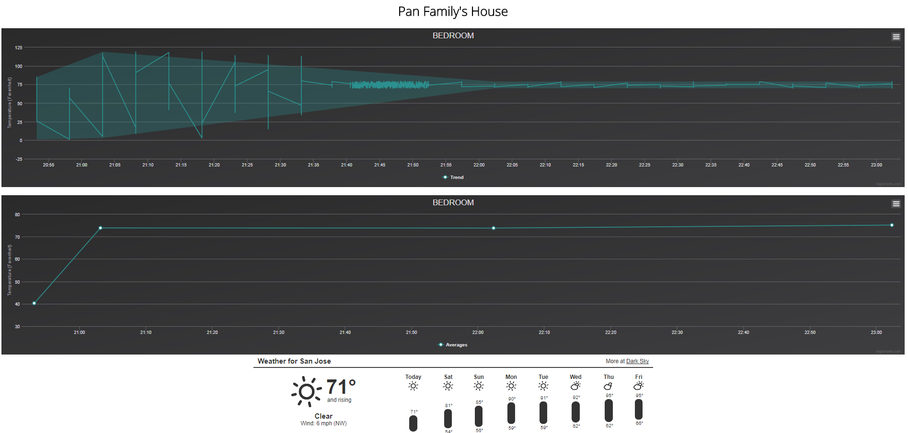

## esp32-temperature-server
    This is a simple project that barely touches on the capability of the ESP32.  Simple socket interfacing,
    python web server, JSON parsing, and javascript data manipulation was used.

## ESP32
    An ESP32 microcontroller is used to read temperature readings from any room in the house, and send it
    over a socket to a local server running on the computer.  The server stores a dictionary of all the readings, 
    calculating averages, highs, lows, to display trends on a few graphs.
    
## Future
    I am hoping to get a cheaper setup that can use the temperature sensor and relay information to the computer.
    Currently the ESP32 costs $12 and that is too expensive for a basic temperature reader.  However, if there are 
    multiple microcontrollers set up around the house maybe they can be used simulatenously for other tasks.
    
### First working charts with dummy data

